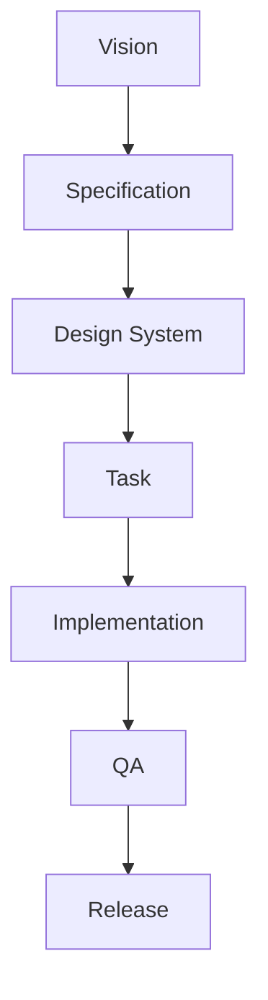
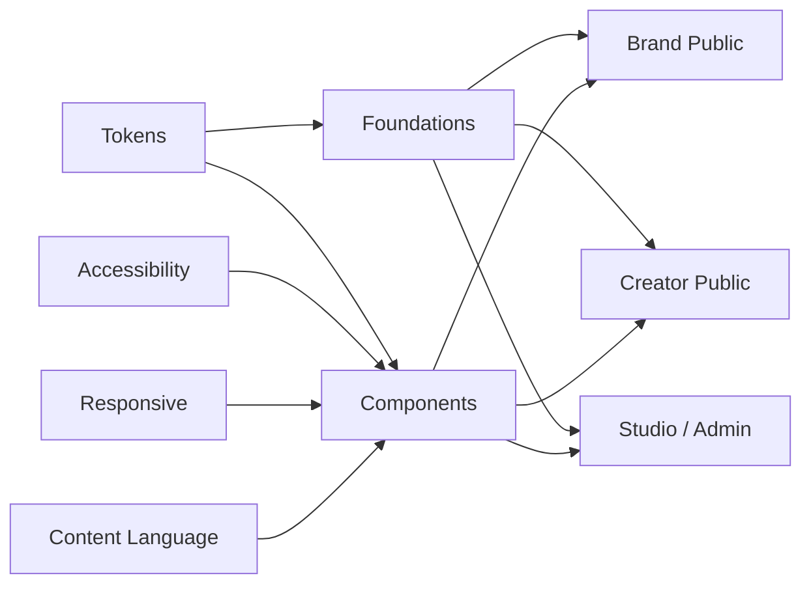

# RELMUA Design System

The Design System defines how RELMUA should look, feel, and behave.

It is not only a color guide.

It is the contract for:

- Brand Public.
- Creator Public.
- Studio / Admin.

## Reading Flow

## Recommended Reading Order

1. [Foundations](foundations.md)
2. [Tokens](tokens.md)
3. [Color and Theme](color-theme.md)
4. [Typography](typography.md)
5. [Spacing and Layout](spacing-layout.md)
6. [Accessibility](accessibility.md)
7. [Responsive](responsive.md)
8. [Motion](motion.md)
9. [Content Language](content-language.md)
10. [Brand Public](public-brand.md)
11. [Creator Public](public-creator.md)
12. [Studio / Admin](studio-admin.md)
13. [Components](components/button.md)

## Design System Map

## Root Documents

| Document | Role |
| --- | --- |
| [Foundations](foundations.md) | Visual hierarchy, surfaces, states, density, and system rules. |
| [Tokens](tokens.md) | Primitive and semantic token architecture. |
| [Typography](typography.md) | Text scale, Japanese reading rules, labels, code, and numbers. |
| [Spacing and Layout](spacing-layout.md) | Spacing scale, max width, grids, and breakpoints. |
| [Color and Theme](color-theme.md) | Light/Dark theme rules and color meaning. |
| [Motion](motion.md) | Motion as state support, not decoration. |
| [Accessibility](accessibility.md) | WCAG AA-level baseline. |
| [Content Language](content-language.md) | Human wording for technical actions. |
| [Brand Public](public-brand.md) | RELMUA brand site design rules. |
| [Creator Public](public-creator.md) | Creator site design rules and token differences. |
| [Studio / Admin](studio-admin.md) | Production tool design rules. |
| [Responsive](responsive.md) | 375, 390, 430, 768, 1024, 1440 behavior. |

## Component Documents

- [Button](components/button.md)
- [Link](components/link.md)
- [Card](components/card.md)
- [Badge and Tag](components/badge-tag.md)
- [Form Controls](components/form-controls.md)
- [Modal](components/modal.md)
- [Toast and Feedback](components/toast-feedback.md)
- [Navigation](components/navigation.md)
- [Table](components/table.md)
- [Empty and Error](components/empty-error.md)
- [Danger Zone](components/danger-zone.md)
- [Status Indicator](components/status-indicator.md)

## System Rule

Brand Public, Creator Public, and Studio / Admin may share tokens and component
contracts.

They must not feel like the same surface.

Brand is calm and editorial.

Creator is personal and themeable.

Studio is dense, safe, and operational.

