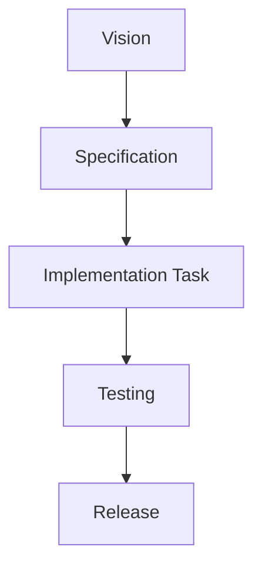
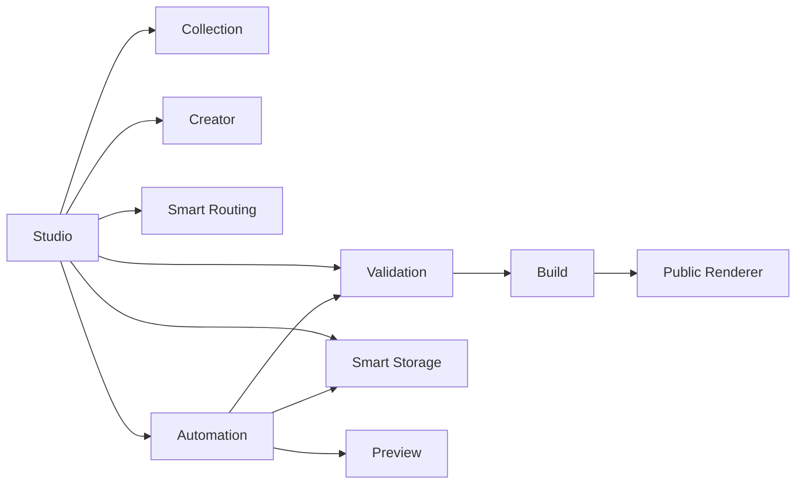

# RELMUA v2 Specification

Specification defines how RELMUA works.

Vision explains why RELMUA exists.

Specification explains what each part must do so implementation tasks can be
small and consistent.

## Reading Flow

## Recommended Reading Order

1. [Studio Layout](studio/layout.md)
2. [Studio Workspace](studio/workspace.md)
3. [Studio Onboarding](studio/onboarding.md)
4. [Studio Modes](studio/modes.md)
5. [Collection Overview](collection/overview.md)
6. [Collection Common Fields](collection/common-fields.md)
7. [TRPG Collection](collection/trpg.md)
8. [Creator Overview](creator/overview.md)
9. [Public Renderer](public/renderer.md)
10. [Validation Common](validation/common.md)
11. [Smart Storage](storage/smart-storage.md)
12. [Smart Routing](routing/smart-routing.md)
13. [Automation Workflow](automation/workflow.md)
14. [Build Pipeline](build/pipeline.md)

## Specification Map

## Directory Roles

| Directory | Role |
| --- | --- |
| `studio/` | How Studio is arranged and how users interact with it. |
| `collection/` | Library/Collection data model and type-specific contracts. |
| `creator/` | Creator ownership and creator module rules. |
| `public/` | Public rendering, navigation, and theme behavior. |
| `validation/` | Validation timing, messages, and field rules. |
| `build/` | Build pipeline and build manifest. |
| `routing/` | Automatic route, breadcrumb, sitemap, and canonical behavior. |
| `storage/` | Automatic canonical storage and backup target behavior. |
| `automation/` | Save/import/publish automation workflow. |

## Rules

- Specification must not contradict Vision.
- Specification must be concrete enough to implement.
- Public remains read-only.
- Studio owns editing and operations.
- TRPG remains fully compatible as Collection Type 1.
- Users should not need to understand folders or JSON in Beginner mode.

