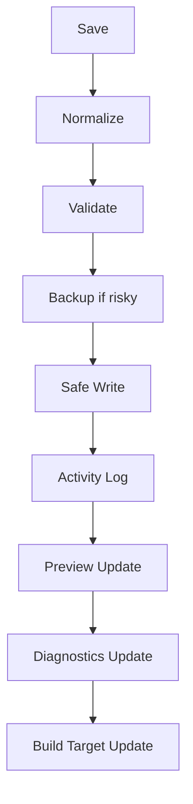

# Automation Workflow Specification

Automation is required for safety and simplicity.

## Save Workflow

## Required Steps

1. Normalize.
2. Validate.
3. Backup when writing canonical data.
4. Safe Write.
5. Activity Log.
6. Preview update.
7. Diagnostics update.
8. Build target update.

## Failure Handling

- Validation failure stops write.
- Backup failure stops risky write.
- Safe Write failure attempts rollback.
- Diagnostics failure must be visible.
- Activity Log should record failure when possible.

## User Message

After automation, show:

- What happened.
- Whether it succeeded.
- What to do next.

