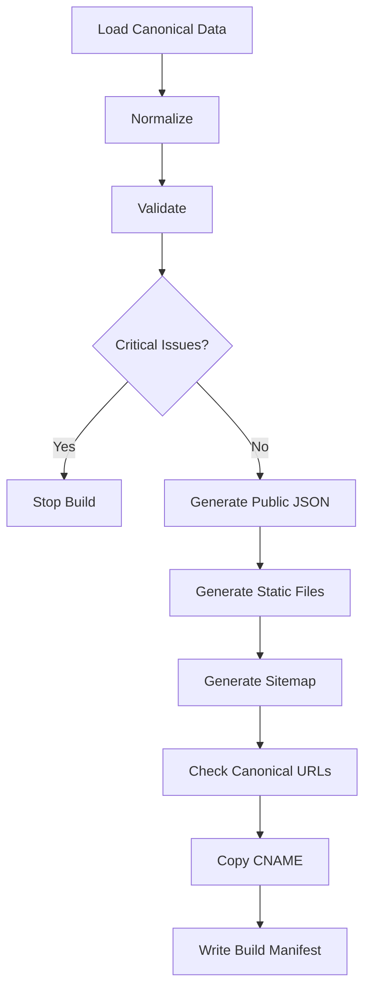

# Build Pipeline Specification

Build assembles public output from validated data.

## Pipeline

## Requirements

- Validation runs before public generation.
- Critical issues stop publish-ready build.
- Public JSON excludes private/admin-only fields.
- Sitemap and canonical URLs use configured public origin.
- CNAME is preserved when configured.
- Admin files must not appear in dist.

