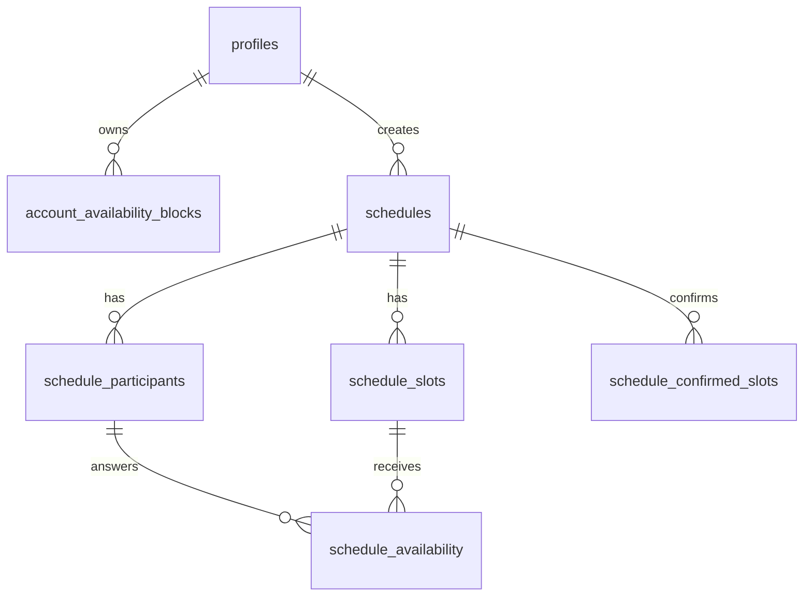

# RELMUA Schedule Specification

RELMUA Schedule is a dynamic scheduling service for casual event coordination.
It is separate from the static Public JSON publishing flow.

The first implementation must keep the same product principle as the existing
site: use the browser when possible, and use the backend only for data that must
be saved, shared, synchronized, or protected.

## Product Boundary

Schedule belongs to RELMUA Brand.

It is not a Chikage TRPG-only feature, even though TRPG sessions are an important
initial use case.

Schedule must support:

- Guest participation without account registration.
- RELMUA Account participation with saved availability.
- Shared URL access.
- Confirmed slots.
- Privacy-preserving busy synchronization.
- Creator-scoped entry points that reuse the same generic schedule model.
- Expiration of schedule data.

Schedule must not require:

- Account registration for basic response.
- Calendar connection for MVP.
- Disclosure of another user's private event title or details.
- Public JSON export.
- Browser Admin localStorage as the source of truth.

## Client Roles

### Public Web

`apps/web/schedule/` is the expected public entry point.

It may load a public Supabase anon key, but it must never include:

- `service_role` key.
- database password.
- private API secret.
- migration credentials.

### Admin

The current Admin app remains a local production tool for static RELMUA content.

Schedule operational screens may be added later, but Schedule data must not be
stored in the existing Admin localStorage keys.

### Studio

Studio may eventually surface Schedule health, migration state, and diagnostics.
It should not become the only way to use Schedule.

## Data Lifecycle

Schedule data is not permanent.

Every schedule-owned record should include:

- `created_at`.
- `updated_at`.
- `expires_at`.

The default expiration rule is:

```text
expires_at = updated_at + 1 year
```

Account, profile, user settings, and reusable availability templates have a
different lifecycle and must not be deleted only because a schedule expires.

## Core Entities



### `profiles`

RELMUA Account profile.

Suggested fields:

- `id`.
- `user_id`.
- `display_name`.
- `timezone`.
- `created_at`.
- `updated_at`.

### `account_availability_blocks`

Reusable availability owned by an authenticated user.

Suggested fields:

- `id`.
- `user_id`.
- `starts_at`.
- `ends_at`.
- `availability`: `available`, `maybe`, `busy`.
- `note_private`.
- `source`: `manual`, `confirmed_schedule`, `calendar_freebusy`.
- `source_ref`.
- `created_at`.
- `updated_at`.

This table is not the same as a response to one schedule.

### `schedules`

One scheduling board.

Suggested fields:

- `id`.
- `owner_user_id`.
- `public_token_hash`.
- `title`.
- `description`.
- `timezone`.
- `required_total_minutes`.
- `slot_min_minutes`.
- `slot_max_minutes`.
- `allow_maybe`.
- `all_required`.
- `consecutive_policy`.
- `preference_policy`.
- `created_at`.
- `updated_at`.
- `expires_at`.

### `schedule_slots`

Candidate dates or time ranges for a schedule.

Suggested fields:

- `id`.
- `schedule_id`.
- `starts_at`.
- `ends_at`.
- `label`.
- `order`.
- `created_at`.
- `updated_at`.
- `expires_at`.

### `schedule_participants`

A named participant in one schedule.

Suggested fields:

- `id`.
- `schedule_id`.
- `user_id`, nullable.
- `guest_token_hash`, nullable.
- `display_name`.
- `created_at`.
- `updated_at`.
- `expires_at`.

Rules:

- A participant can be a guest or an authenticated user.
- Guest identity must be scoped to one schedule.
- Guest tokens must not expose account identity.

### `schedule_availability`

Participant responses for candidate slots.

Suggested fields:

- `id`.
- `schedule_id`.
- `participant_id`.
- `slot_id`.
- `answer`: `yes`, `maybe`, `no`.
- `comment`.
- `created_at`.
- `updated_at`.
- `expires_at`.

`comment` may contain private or sensitive context. Public views must show only
what the current schedule audience is allowed to see.

### `schedule_confirmed_slots`

Confirmed result for a schedule.

Suggested fields:

- `id`.
- `schedule_id`.
- `starts_at`.
- `ends_at`.
- `created_by`.
- `created_at`.
- `updated_at`.
- `expires_at`.

Confirmed slots may generate account busy blocks for authenticated
participants. Other schedules should see only that the user is busy during that
time range.

## Row Level Security Requirements

RLS is mandatory before production.

Minimum policy intent:

- A profile can be read or edited only by its owner, unless a public profile
  contract is explicitly added.
- A user can read and edit only their own reusable availability.
- A schedule owner can edit schedule settings and candidate slots.
- A participant can edit only their own response.
- Guest access is limited by a schedule-scoped token.
- Public schedule views may read only the schedule fields, participant display
  names, candidate slots, and responses needed for that shared board.
- Busy synchronization exposes only time ranges and busy state, not titles,
  comments, source names, or private notes.

## Migration Rule

Database changes must be committed as migrations.

The project should add a dedicated migration directory before the first table is
created, for example:

```text
supabase/migrations/
```

Manual Dashboard changes may be used for exploration only when the final schema
is converted into a committed migration before handoff.

## MVP Scope

The first database-backed usable slice should include:

- Create schedule.
- Add candidate slots.
- Share URL.
- Guest display name.
- Guest yes/maybe/no response.
- Optional maybe comment.
- Owner confirmation of one or more slots.
- `expires_at` assignment.

MVP should not include:

- Google Calendar integration.
- Paid features.
- Cross-schedule busy sync.

Those depend on the account and privacy model.

Before the database slice, a static Chikage TRPG prototype may validate the
Schedule interaction model: organizer adjustment windows, participant
availability, ranked candidates, and completion plans. See
[Schedule Interaction Model](./table-scheduler.md).

## Later Phases

1. RELMUA Account profile.
2. Saved account availability.
3. Cross-schedule busy sync.
4. Auto scheduling recommendations and multi-session completion plans.
5. Calendar free/busy import.
6. Calendar write-back for confirmed slots.
7. Deletion notifications and expiration extension.

## Validation

Before release, Schedule must have tests or checks for:

- RLS policy intent.
- Guest token scoping.
- Secret leakage prevention.
- Date and timezone normalization.
- Expiration field presence.
- Availability answer normalization.
- Busy sync privacy.
- Accessibility for yes/maybe/no controls.
- Mobile layout for schedule grids.
