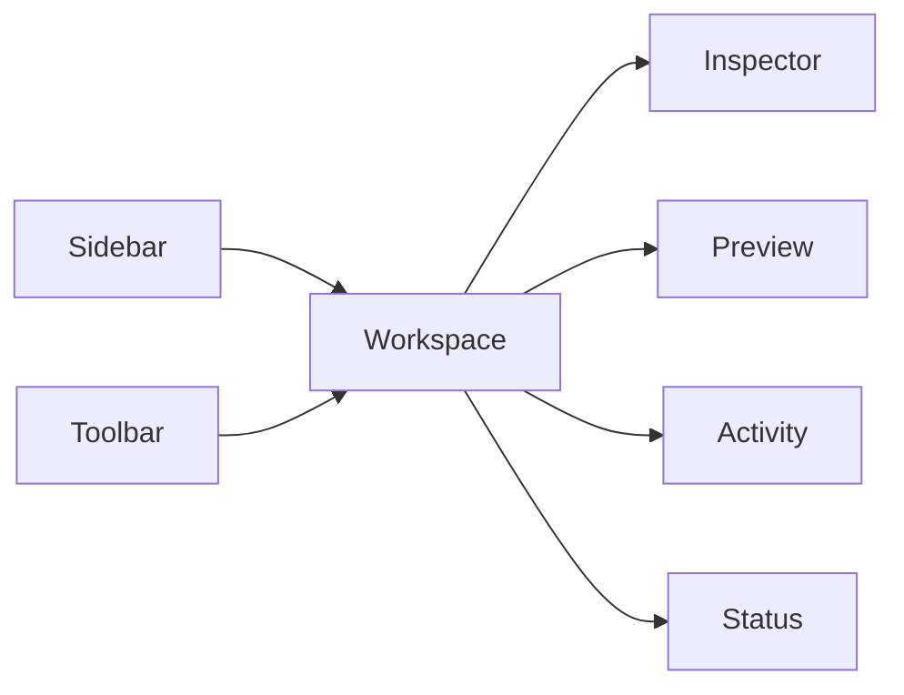

# Studio Layout Specification

Studio is a production desk.

It should be dense enough for daily work, but clear enough for a beginner.

## Layout Areas

## Sidebar

Purpose:

- Show main areas: Brand, Creators, System.
- Show current area.
- Keep navigation stable.

Must not:

- Show raw file paths.
- Mix creator-only modules into Brand.
- Hide the way back to Terminal.

## Workspace

Purpose:

- Main editing and review area.
- Shows one primary task at a time.

Must show:

- Title.
- Short human explanation.
- One next action.
- Save state when editing.

## Inspector

Purpose:

- Show details for the selected item.
- Show validation details in Standard and Advanced modes.

Beginner mode:

- Show plain explanations.
- Hide raw schema and paths.

Advanced mode:

- May show JSON field names, schema version, public mapping, and diagnostics.

## Preview

Purpose:

- Show how the content will appear before publishing.
- Update after safe draft changes.

Must not:

- Become a second source of truth.
- Mutate canonical data directly.

## Activity

Purpose:

- Show recent actions and results.
- Explain automation.

Minimum fields:

- Date/time.
- Target.
- Operation.
- Result.
- Undo availability.

## Status

Purpose:

- Show health at a glance.

Should include:

- Validation.
- Backup.
- Build.
- Git read-only state.
- Publish readiness.

## Toolbar

Purpose:

- Hold common actions.

Beginner:

- Add.
- Save.
- Preview.
- Publish readiness.

Advanced:

- Diagnostics.
- Build.
- Migration.
- Manifest.

