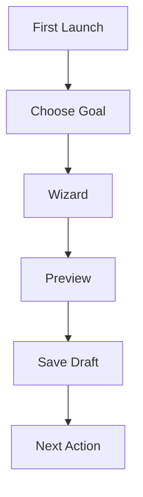

# Studio Onboarding Specification

Studio onboarding asks a human question first:

> What do you want to do?

## First Choices

Beginner mode should show:

- Add a new work.
- Write a production note.
- Register TRPG content.
- Update the site.
- View the public site.

## Flow

## Project Root Missing

If no project root is configured, Studio must explain:

> Choose the RELMUA project folder so Studio knows where your data lives.

It must not start with a technical-only message.

## Completion Standard

Within five minutes, a first-time user should be able to:

- Create one draft, or
- Preview the public site, or
- Check whether the site is ready to publish.

