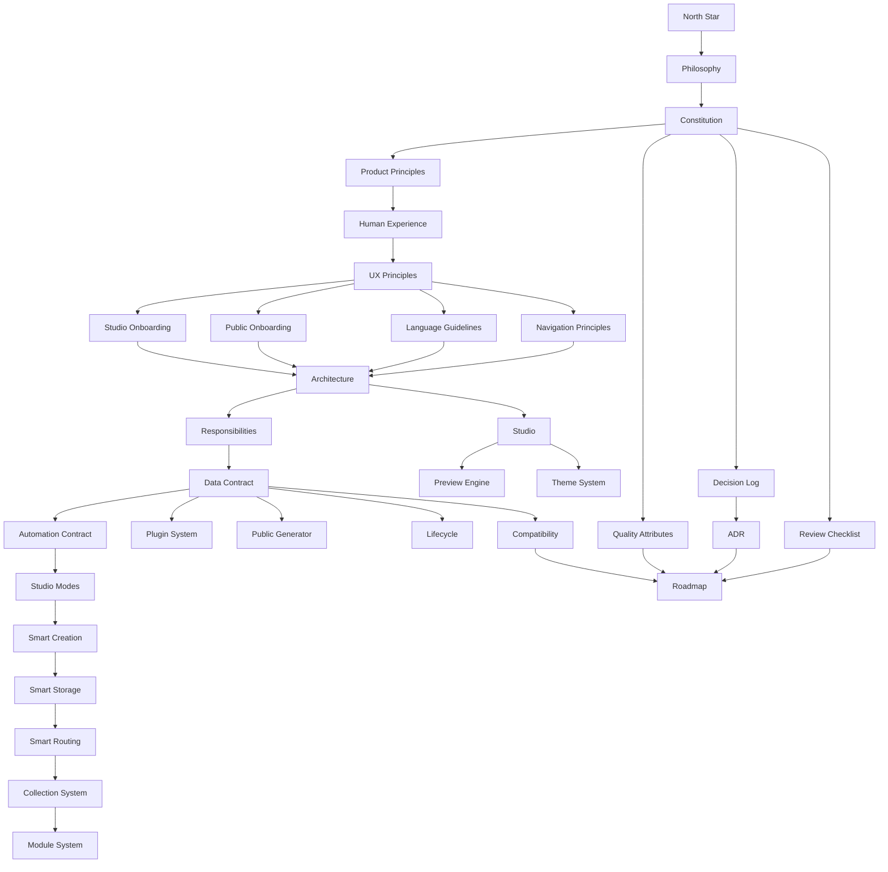

# RELMUA Vision

This directory defines RELMUA as a Brand OS.

Read these documents before making large architecture, product, data, module, or
Studio decisions.

## Reading Order

1. [North Star](north-star.md)
2. [Philosophy](philosophy.md)
3. [Constitution](constitution.md)
4. [Product Principles](product-principles.md)
5. [Human Experience](human-experience.md)
6. [UX Principles](ux-principles.md)
7. [Studio Onboarding](studio-onboarding.md)
8. [Public Onboarding](public-onboarding.md)
9. [Language Guidelines](language-guidelines.md)
10. [Navigation Principles](navigation-principles.md)
11. [Architecture](architecture.md)
12. [Responsibilities](responsibilities.md)
13. [Data Contract](data-contract.md)
14. [Automation Contract](automation-contract.md)
15. [Studio Modes](studio-modes.md)
16. [Smart Creation](smart-creation.md)
17. [Smart Storage](smart-storage.md)
18. [Smart Routing](smart-routing.md)
19. [Collection System](collection-system.md)
20. [Module System](module-system.md)
21. [Plugin System](plugin-system.md)
22. [Public Generator](public-generator.md)
23. [Studio](studio.md)
24. [Preview Engine](preview-engine.md)
25. [Theme System](theme-system.md)
26. [Quality Attributes](quality-attributes.md)
27. [Lifecycle](lifecycle.md)
28. [Compatibility](compatibility.md)
29. [Decision Log](decision-log.md)
30. [ADR](adr/README.md)
31. [Review Checklist](review-checklist.md)
32. [Roadmap](roadmap.md)

## Vision Map

## Document Roles

| Document | Role |
| --- | --- |
| North Star | The shortest statement of what RELMUA is for. |
| Philosophy | The product philosophy and ten-year question. |
| Constitution | Absolute principles that should not be casually broken. |
| Product Principles | RELMUA as a Brand OS from operation, UX, maintainability, and future growth. |
| Human Experience | Human-centered quality standard for beginners, creators, admins, collaborators, and future maintainers. |
| UX Principles | Studio UX rules for beginner-safe operation. |
| Studio Onboarding | First-launch guidance for starting safely in Studio. |
| Public Onboarding | Three-second understanding and page guidance for visitors. |
| Language Guidelines | Human-readable wording for technical actions. |
| Navigation Principles | Rules for current location, next action, back paths, and related pages. |
| Architecture | The target system shape and dependency direction. |
| Responsibilities | Boundaries between Brand, Studio, Public, Creator, Module, Plugin, and System. |
| Data Contract | Rules for schema, validation, backup, import, export, and public mapping. |
| Automation Contract | Required visible automation flows for Studio operations. |
| Studio Modes | Beginner, Standard, and Advanced visibility model. |
| Smart Creation | One-button creation and wizard-first UX. |
| Smart Storage | Automatic storage decisions without exposing folders to beginners. |
| Smart Routing | Automatic route, navigation, breadcrumb, preview, sitemap, and canonical generation. |
| Collection System | Collection Type architecture with TRPG as the first compatible type. |
| Module System | How creator-owned and future modules should work. |
| Plugin System | How external capability should be added without owning data. |
| Public Generator | How Public output is produced safely. |
| Studio | What Studio owns and how it should behave. |
| Preview Engine | How preview should work without becoming a second Public implementation. |
| Theme System | How visual configuration should be edited and generated. |
| Quality Attributes | The order of quality priorities. |
| Lifecycle | Module states from idea to removal. |
| Compatibility | How schema, Public JSON, Build, and Studio compatibility are protected. |
| Decision Log | Chronological record of major design choices. |
| ADR | Detailed records for future architecture decisions. |
| Review Checklist | Required questions before adding or changing features. |
| Roadmap | Long-term architecture phases. |

## Rule for Future Work

Before large implementation work, read:

1. [North Star](north-star.md)
2. [Constitution](constitution.md)
3. [Review Checklist](review-checklist.md)

Then write or update an ADR when the decision changes architecture.
