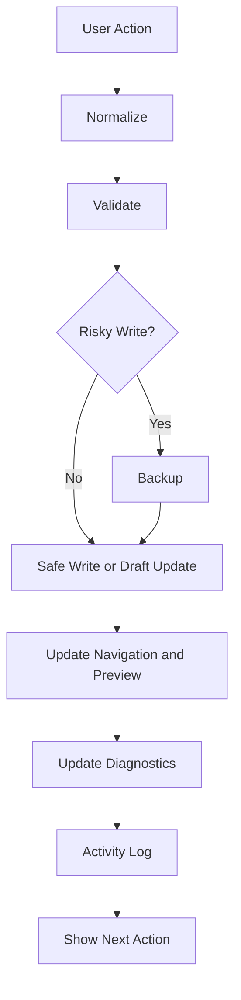

# Studio Automation Contract

Automation is part of Studio's safety model.

Automation must be visible, logged, and recoverable.

## Automation Flow

Most operations follow this pattern:

## Project Addition

When a Project is added, Studio must:

1. Create a draft record.
2. Validate required fields.
3. Decide storage automatically.
4. Create backup before writing canonical data.
5. Safe write.
6. Update navigation if public routes are affected.
7. Update preview.
8. Update diagnostics.
9. Update build target list.
10. Log activity.

## Collection Addition

When a Collection is added, Studio must:

1. Ask for collection type.
2. Select schema by type.
3. Create draft data.
4. Validate common fields.
5. Validate type-specific fields.
6. Decide storage automatically.
7. Create backup before canonical write.
8. Register route and breadcrumb when needed.
9. Update preview.
10. Update diagnostics.
11. Log activity.

## Creator Addition

When a Creator is added, Studio must:

1. Create creator draft.
2. Validate creator ID and slug.
3. Decide creator site route.
4. Decide storage automatically.
5. Create backup before writing.
6. Update Creator index.
7. Update navigation and sitemap when public.
8. Update preview.
9. Update diagnostics.
10. Log activity.

## Note Addition

When a Note is added, Studio must:

1. Create draft note.
2. Validate title and visibility.
3. Decide storage automatically.
4. Update preview.
5. Update diagnostics.
6. Log activity.

## Tool Addition

When a Tool is added, Studio must:

1. Create draft tool.
2. Validate category, URL, and public status.
3. Decide storage automatically.
4. Update preview.
5. Update diagnostics.
6. Log activity.

## Page Addition

When a Page is added, Studio must:

1. Ask what area owns the page.
2. Select route pattern.
3. Create draft page data.
4. Validate slug and owner.
5. Update navigation only if requested.
6. Update preview.
7. Update diagnostics.
8. Log activity.

## Delete

When deleting, Studio must:

1. Explain what will be removed.
2. Show affected routes and references.
3. Require confirmation.
4. Create backup.
5. Remove or archive according to lifecycle.
6. Update navigation.
7. Update diagnostics.
8. Log activity.
9. Offer rollback.

## Import

When importing, Studio must:

1. Read file.
2. Parse JSON.
3. Detect module/domain.
4. Validate schemaVersion.
5. Show preview.
6. Show conflicts.
7. Create rollback backup.
8. Confirm.
9. Safe write.
10. Update diagnostics.
11. Log activity.

## Restore

When restoring, Studio must:

1. Show backup metadata.
2. Show affected files.
3. Validate backup manifest.
4. Create backup of current state.
5. Restore safely.
6. Verify checksum.
7. Update diagnostics.
8. Log activity.

## Publish

When publishing, Studio must:

1. Run validation.
2. Run diagnostics.
3. Block Critical issues.
4. Build public output.
5. Read build manifest.
6. Confirm Admin is not included.
7. Confirm CNAME and canonical origin.
8. Show preview or output path.
9. Log activity.

## Automation Rule

Automation must not hide risk.

For every automated action, Studio must show:

- What happened.
- Why it happened.
- Whether it succeeded.
- How to recover if it failed.

