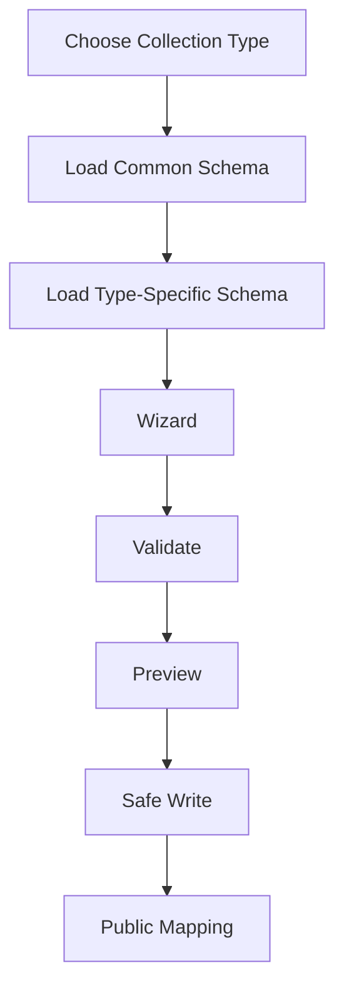

# Collection System

Collections are structured creative sets.

TRPG must not be replaced.

TRPG is the first Collection Type.

## Purpose

Collection System lets RELMUA support future structured domains without turning
every new domain into a custom one-off editor.

Examples:

- TRPG
- Game
- Book
- Music
- Custom

## TRPG Compatibility

Existing TRPG behavior must remain compatible:

- Existing JSON shape.
- Existing Export identity.
- Existing Public URL policy.
- Existing search.
- Existing filter.
- Existing favorite.
- Existing scenario detail.
- Existing House Rules.
- Existing backup/import compatibility.

TRPG can become Collection Type 1 in the architecture without breaking the
current public and data contracts.

## Common Collection Fields

Every Collection Type should define:

- id
- owner
- title
- slug
- status
- visibility
- summary
- description
- tags
- order
- createdAt when part of internal data
- updatedAt when part of internal data
- public route
- preview route

Public mapping decides which fields become public.

## TRPG-Specific Fields

TRPG may define:

- scenario system
- player count
- play time
- rating
- author
- storage location
- tags
- public warning
- scenario URL
- House Rules sections
- favorite support on Public

These remain TRPG-specific and should not leak into all collections.

## Game-Specific Fields

Game may define:

- platform
- genre
- development status
- release URL
- repository URL when public-safe
- engine or technology
- screenshots or visual placeholders

## Book-Specific Fields

Book may define:

- format
- volume
- reading order
- excerpt
- publication status
- related notes

## Music-Specific Fields

Music may define:

- track list
- duration
- release format
- composer/arranger credits
- audio preview policy
- platform links

## Custom Extensions

Custom Collection Types may define additional fields.

Custom fields require:

- Schema.
- Validation.
- Preview behavior.
- Public mapping.
- Backup/import/export behavior.

## Collection Flow

## Collection Rule

A new Collection Type must not weaken existing TRPG compatibility.

