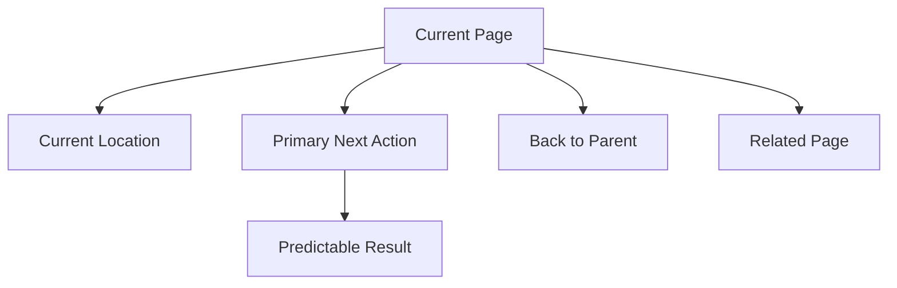

# Navigation Principles

Navigation exists to prevent confusion.

Every navigation choice should make the user more oriented, not more lost.

## Goals

Navigation must show:

- Where am I?
- Where can I go next?
- How do I go back?
- What is related?
- What will happen if I press this?

## Current Location

Every Studio area should show current location.

Example:

```text
RELMUA Studio / Creators / Chikage / TRPG / Scenario Library
```

Every Public area should make it clear whether the user is in:

- Brand.
- Creator Site.
- Collection.
- System or compatibility route.

## Next Place

Every page should offer one primary next place.

Too many equal links create hesitation.

Secondary links are allowed, but the main next action should be obvious.

## Back Path

Users should always be able to return to the parent context.

Examples:

- From TRPG to Chikage.
- From Chikage to RELMUA.
- From Project detail to Projects.
- From System screen to Terminal.

## Related Pages

Related links should explain why they are related.

Bad:

```text
Links
```

Better:

```text
Next, read the production notes behind this work.
```

## Predictable Results

A button or link should make its result clear.

Examples:

- Preview site.
- Save draft.
- Create public data.
- Publish site.
- Return to RELMUA.

Avoid labels that hide risk:

- Execute.
- Run.
- Apply.
- OK.

## Studio Navigation

Studio navigation should be organized by responsibility:

- Brand
- Creators
- System

Beginner mode should show fewer choices.

Advanced mode may reveal technical routes such as Diagnostics, Manifest, Git,
and Migration.

## Public Navigation

Public navigation should be simple and stable.

Brand pages should not expose creator module internals as global categories.

Creator Sites should clearly offer a way back to RELMUA.

TRPG should remain inside creator context.

## Navigation Flow



## Navigation Test

For every page, ask:

- Can the user name where they are?
- Can they return to the parent page?
- Is there one clear next action?
- Are related links meaningful?
- Does every button say what it will do?

