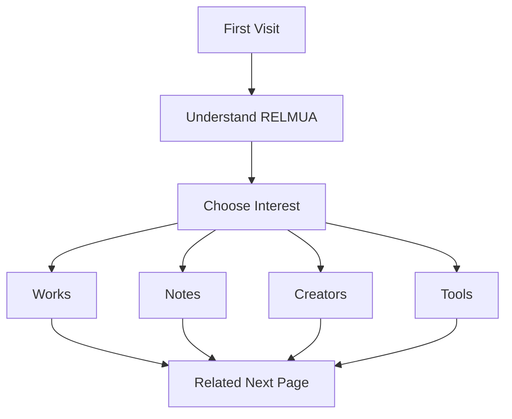

# Public Onboarding

Public onboarding helps a first-time visitor understand RELMUA in three seconds.

Public is not an editor.

Public is a guided experience.

## Three-Second Understanding

The first visible message should answer:

- What is RELMUA?
- What can I see here?
- Where should I go next?

RELMUA should be understood as:

> A creative brand that grows works, tools, notes, and creator activity.

## Page-Level Guidance

Every public page should naturally answer:

- What can I do on this page?
- What should I see next?
- What is related?

This should feel like editorial guidance, not a manual.

## Public Flow

## Page Guidance Model

| Page | This Page Does | Next Page | Related Page |
| --- | --- | --- | --- |
| Home | Introduces RELMUA and highlights one path. | Projects or Creators. | Notes. |
| Projects | Shows works as an exhibition. | Notes. | Creators. |
| Tools | Shows public shared tools when available. | Projects. | Contact. |
| Notes | Shows production records. | Projects. | About. |
| Creators | Introduces people. | Creator Site. | About. |
| About | Explains brand story. | Projects. | Contact. |
| Contact | Guides where to ask. | Creators or About. | Home. |
| Creator Site | Introduces one creator. | Works or Contact. | RELMUA Home. |
| TRPG | Lets users search and keep scenarios. | House Rules. | Creator Site. |
| House Rules | Lets users read rules by section. | TRPG. | Creator Site. |

## Public Rules

- Do not overwhelm visitors with every route.
- Do not make Home a sitemap.
- Show one primary next step per page.
- Keep creator and brand responsibilities clear.
- Keep TRPG inside creator context.
- Use plain language before technical language.

## Public Onboarding Test

A first-time visitor should be able to answer:

- What is RELMUA?
- Is this a brand page or creator page?
- Where can I see works?
- Where can I read notes?
- Where can I find creator activity?
- Where do I go next?

