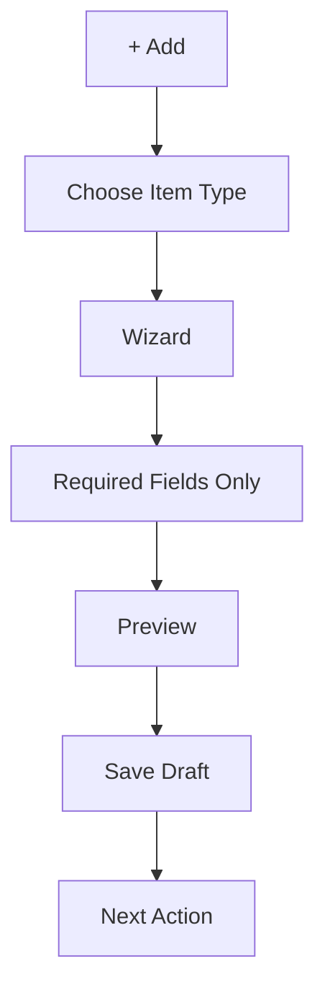

# Smart Creation

Creation starts with one button:

> Add

The user chooses what they want to create, not where it should be stored.

## Createable Items

Studio should eventually support adding:

- Project
- Collection
- Note
- Tool
- Creator
- Page

## Creation Flow

## Wizard Rules

A wizard should:

- Ask one small group of questions at a time.
- Explain each choice in human words.
- Show required fields clearly.
- Allow preview before publish.
- Save draft safely.
- Avoid exposing file paths.

## Project Wizard

Ask:

- Title.
- Short description.
- Status.
- Public or draft.

Later:

- Tags.
- Links.
- Visual.
- Related creator.

## Collection Wizard

Ask:

- Collection Type.
- Owner.
- Title.
- Public or private.

Then load type-specific questions.

TRPG-specific questions appear only for TRPG.

## Note Wizard

Ask:

- Title.
- Summary.
- Draft or public.

Content can be edited after creation.

## Tool Wizard

Ask:

- Tool name.
- What it does.
- URL or local feature target.
- Public or draft.

## Creator Wizard

Ask:

- Display name.
- Slug.
- Short intro.
- Public or private.

Advanced fields can wait.

## Page Wizard

Ask:

- Owner.
- Page title.
- Purpose.
- Public or internal.

Studio generates route and navigation suggestions.

## Smart Creation Rule

Creation should never begin by asking for a filename.

