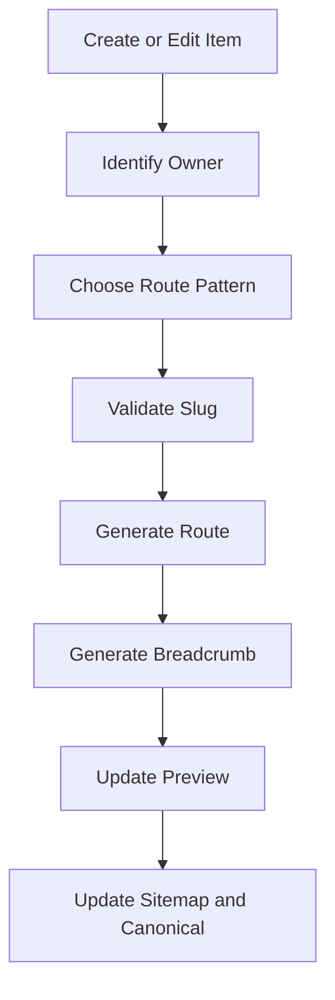

# Smart Routing

Users should not manually maintain routes.

Studio should generate route-related output from Creator, Collection, Project,
and Page data.

## Generated Routing Artifacts

When an item is added or changed, Studio should update:

- Route
- Navigation
- Breadcrumb
- Preview route
- Sitemap
- Canonical URL
- OGP URL when relevant

## Routing Flow

## Creator

Creator routes should be generated from creator identity and slug.

Creator modules belong under the Creator route unless a future contract says
otherwise.

## Collection

Collection routes should come from:

- Owner.
- Collection Type.
- Slug.

TRPG remains compatible with existing canonical route policy.

## Project

Project routes should be brand-owned unless explicitly assigned elsewhere.

## Page

Pages must declare owner:

- Brand.
- Creator.
- System-only.

Only public owners produce public routes.

## Smart Routing Rule

Users choose meaning.

Studio chooses route structure.

Advanced mode can show the generated route, but users should not be required to
type internal paths.

