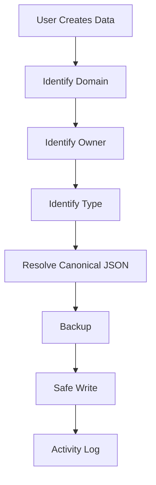

# Smart Storage

Users do not choose storage paths.

Studio decides storage based on content meaning.

## Principle

The user should think:

- This is a Project.
- This belongs to Chikage.
- This is a TRPG collection.
- This is a Note.

The user should not think:

- Which folder?
- Which JSON file?
- Which build output?
- Which backup path?

## Storage Decision Inputs

Studio decides storage from:

- Domain.
- Module.
- Creator.
- Collection Type.
- Visibility.
- Schema version.

## Studio Determines

Studio should automatically determine:

- Canonical JSON.
- Backup location.
- Build target.
- Public mapping.
- Activity log entry.
- Diagnostics scope.
- Preview target.

## Storage Flow

## Beginner Rule

Folder structure should not be visible in Beginner mode.

Standard mode may show friendly destinations.

Advanced mode may show actual paths.

## Safety Rule

Smart Storage must never mean arbitrary storage.

Allowed paths come from registry and data contracts.

Project Root escape is forbidden.

