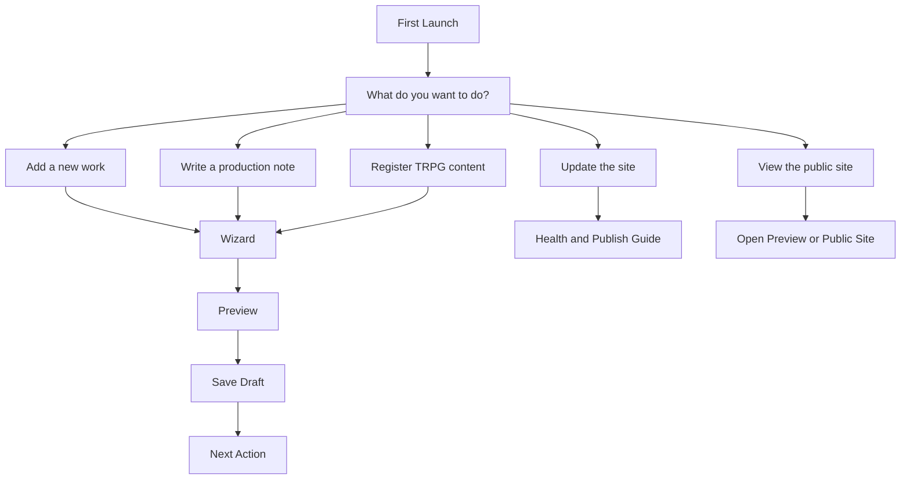

# Studio Onboarding

Studio onboarding should help a new user start without understanding internal
systems.

The first screen should ask:

> What do you want to do?

## First Choices

Beginner onboarding should offer choices like:

- Add a new work.
- Write a production note.
- Register TRPG content.
- Update the site.
- View the public site.

These are human goals, not technical tasks.

## Onboarding Flow

## Choice Mapping

| User Choice | Studio Meaning | Hidden Internal Work |
| --- | --- | --- |
| Add a new work | Create Project draft. | Choose canonical JSON, validate, update preview. |
| Write a production note | Create Note draft. | Choose notes data, validate, update preview. |
| Register TRPG content | Open Chikage TRPG collection wizard. | Use TRPG schema, preserve compatibility. |
| Update the site | Run health and publish guidance. | Validation, diagnostics, build readiness. |
| View the public site | Open preview/public route. | Resolve route and current build status. |

## First Launch Requirements

First launch should show:

- Project name.
- Current health.
- Last backup status.
- Last build status.
- One recommended next action.

It should not begin with:

- File path picker unless project root is missing.
- Raw Git status.
- Raw JSON list.
- Build logs.
- Manifest details.

## Project Root Missing

If Project Root is missing, Studio should explain:

> Choose the RELMUA project folder so Studio knows where your data lives.

It should not say only:

> Select root path.

## Beginner Completion

After five minutes, a new user should have done one safe thing:

- Created a draft.
- Previewed a page.
- Checked publish readiness.
- Opened the public site.

The goal is confidence, not full mastery.

